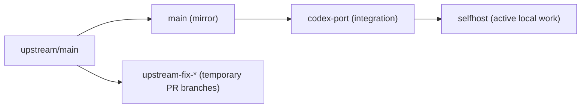

# Memory Report: Branch and Worktree Operating Model

> **Note (2026-04-28):** Project was renamed `sage-codex` → `sage-selfhost`.
> References below preserved verbatim from when this document was written.
>
> **Note (2026-04-28):** Split-default convention adopted. GitHub default
> branch on `alexostl/sage` stays as `main` (clean upstream mirror facade),
> while local `refs/remotes/origin/HEAD` points to `selfhost` so IDE
> diffs and Claude Code Desktop compare against the actual work trunk.
> Self-host PRs target `selfhost` — the GitHub web auto-fill of
> `main` must be re-picked manually. See
> `.sage/docs/learn-sage-selfhost-branch-worktree-model.md` for the current
> contract.

## Summary

This report captures the durable project knowledge produced while reorganizing
`sage-codex` branch roles and worktree layout.

Stored knowledge themes:

- branch role definitions
- Codex worktree placement rules
- update chain from upstream to self-host work
- upstream PR preparation rules
- self-learning/prevention rules for avoiding a repeat of the same confusion

## Key Insights

- `main` is useful only as a manual mirror of `upstream/main`; otherwise it
  becomes a misleading pseudo-source-of-truth.
- `codex-port` and `selfhost` serve different purposes and must stay in
  separate worktrees.
- small upstream bugfix PRs should always be recreated from fresh
  `upstream/main`, not cut from the active integration branches.
- Codex-facing worktrees for this repo belong under
  `~/.codex/worktrees/sage-codex/`.

## Operating Graph

## Memory Entries Captured

### Knowledge

- `sage-codex` branch/worktree operating model
- `main` is a manual upstream mirror, not a freeform working branch
- upstream PR flow for shared fixes in a divergent fork

### Self-learning

- avoid `main/...` branch names when a real `main` branch exists
- keep Codex auxiliary worktrees under the Codex-managed root
- promote repo-operational rules out of cycle-local artifacts immediately

## Related Artifacts

- `.sage/docs/learn-sage-codex-branch-worktree-model.md`
- `.sage/docs/reflect-branch-worktree-operating-model.md`
- `.sage/conventions.md`
- `.sage/work/20260423-branch-worktree-operating-model/`
