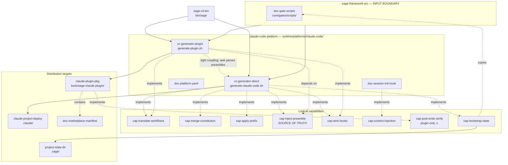

# Claude Port Logic Map

> **Dla kogo:** agent pracujący nad
> [.sage/work/20260429-codex-port-architecture-redesign/spec.md](../20260429-codex-port-architecture-redesign/spec.md).
> Ta mapa NIE jest kopią ani parafrazą tamtego speca. To stan obecny portu
> Claude jako materiał wejściowy do projektowania portu Codex.
>
> **Czego tu NIE ma:** wyboru technologii dla Codex, decyzji architektonicznych
> dla Codex, propozycji rozwiązań. To są zadania architekta. Ta mapa pokazuje
> tylko: co port Claude robi, jak to robi i gdzie ma napięcia/luki.

## Sense-making framing (krytyczne)

Nie ma celu, by Codex przepisać 1:1. Dwa porty mają **osiągnąć ten sam efekt
końcowy** (Sage framework działa tak samo na poziomie zachowań agenta) —
ale **różnymi środkami**, bo Codex ma inne afordancje (CodexAGENTS.md, inny
hook system, inny model dystrybucji, inny model uprawnień, inna obsługa
slash commands po deprecacji 2026-01-22).

Architekt musi:
1. Zrozumieć **CO** port Claude robi (capabilities w sekcji 3 niżej).
2. Zmapować to na **JAK** Codex może to osiągnąć (decyzja architektoniczna).
3. Świadomie wybrać, gdzie **dążyć do parytetu**, a gdzie **rozjechać się
   intencjonalnie** (np. PostToolUse verify może istnieć tylko w jednej
   ścieżce dystrybucji portu Claude — Codex może ujednolicić).

## 1. Modules (5)

| ID | Name | Path | Rola |
|----|------|------|------|
| `proj_ccplat01` | claude-code-platform | `runtime/platforms/claude-code/` | Root portu — kontener adaptera |
| `proj_ccgendir` | cc-generator-direct | `runtime/platforms/claude-code/setup/generate-claude-code.sh` | Generator deploymentu projektowego (`.claude/`) |
| `proj_ccgenplg` | cc-generator-plugin | `runtime/platforms/claude-code/setup/generate-plugin.sh` | Generator pluginu marketplace (`tools/sage-claude-plugin/`) |
| `proj_sagecli1` | sage-cli-bin | `bin/sage` | CLI orchestrator (init/update — odpala oba generatory) |
| `proj_sagesrc1` | sage-framework-src | `sage/` | Boundary node — input portu (read-only) |

## 2. Distribution targets (3)

Port ma **dwie ścieżki dystrybucji** + bootstrapuje stan projektu:

| ID | Target | Path | Forma |
|----|--------|------|-------|
| `proj_ccdeploy` | claude-project-deploy | `.claude/` | CLAUDE.md + commands/*.md + hooks/ + settings.local.json |
| `proj_ccpkg001` | claude-plugin-pkg | `tools/sage-claude-plugin/` | Skills (`disable-model-invocation: true`) + agents/ + hooks.json + scripts/sage |
| `proj_pstate01` | project-state-dir | `.sage/` | work/ + docs/ + decisions.md + gates/ |

**To repo dogfooduje port** — własne `.claude/` jest produktem własnego
generatora.

## 3. Logical capabilities — CO port robi (8)

Najważniejsza sekcja. Architekt Codexa MUSI zrozumieć każdą capability,
nawet jeśli zaimplementuje ją inaczej.

### 3.1 cap-translate-workflows
**Co:** Konwersja generic `core/workflows/*.workflow.md` → format platformy.
- **Direct deploy:** command file w `.claude/commands/<prefix><name>.md`
  z frontmatterem przepuszczonym, `$ARGUMENTS` placeholder na końcu,
  ścieżki podstawiane (sage-navigator, skills/).
- **Plugin:** `SKILL.md` per workflow w `skills/<wf>/` z
  `disable-model-invocation: true`. Specjalne EOF-blocks dla `sage` i `review`.
**Dlaczego ważne:** ten sam logiczny workflow musi pojawić się w dwóch
formatach. Pytanie dla Codexa: czy potrzebuje 1 czy 2 ścieżki?

### 3.2 cap-merge-constitution
**Co:** Czyta `.sage/constitution.md` (preset + project additions),
łączy z bazą + presetem z `core/constitution/presets/`, wstrzykuje do
CLAUDE.md w miejsce `__CONSTITUTION_PLACEHOLDER__`. Numerowanie sekwencyjne.
Python3 z fallbackiem na sed.
**Dlaczego ważne:** każdy projekt może rozszerzyć konstytucję presetem
(startup, enterprise, opensource) i własnymi zasadami. Bake-in przy generacji.

### 3.3 cap-apply-prefix
**Co:** Jeśli `command_prefix: true` w `.sage/config.yaml` → prefiksuje
wszystkie `/cmd` jako `/sage:cmd` w CLAUDE.md (sed) i w nazwach plików.
Kolejność sed-substitutions ma znaczenie (długie nazwy najpierw —
`design-review` przed `design`, `build` przed `b`).
**Tylko direct deploy.** Plugin nie prefiksuje (skills mają inny model).
**Dlaczego ważne:** flat namespace komend Claude'a wymaga unikania kolizji.
Codex po deprecacji slash commands (2026-01-22) nie ma tego problemu — może
użyć innej semantyki (mentions skilli).

### 3.4 cap-inject-preamble ⚠️ KRYTYCZNE
**Co:** Per-workflow compliance preamble (np. "Read persona", "MEMORY FIRST",
"spec.md MUST EXIST", "[A] = REVIEW = run sub-agent", "Save artifacts to
.sage/", "Never use code blocks for interaction") wstrzykiwany na TOP
każdej komendy/skilla.
**Source of truth:** case statement w `generate-claude-code.sh`.
**Plugin generator parsuje go awk-iem** → tight coupling, fragile.
**Dlaczego krytyczne:** to JEDEN z głównych pain pointów portu Claude.
Architekt Codexa powinien rozważyć ekstrakcję preambles do osobnych plików
(YAML/MD per workflow) zamiast inline w bash case.

### 3.5 cap-wire-hooks
**Co:** Rejestracja hooków platformy.
- **Direct deploy:** `.claude/settings.local.json` z SessionStart
  (`matcher: "startup|resume|clear|compact"`) → `bash .claude/hooks/sage-session-init.sh`.
  Atomic write (mktemp + mv).
- **Plugin:** `hooks/hooks.json` z SessionStart (bez matcher) +
  PostToolUse (`matcher: "Write|Edit"`) → `sage-verify.sh ${CLAUDE_PROJECT_DIR}`.
**Asymmetria:** PostToolUse istnieje **TYLKO w pluginie** — direct deploy
nie ma post-edit enforcement.
**Dlaczego ważne dla Codexa:** Codex ma własny mechanizm hooków
(`PreToolUse` matchuje `apply_patch` + MCP tools, per docs research) —
architekt musi zdecydować, czy w Codexie unifikuje obie ścieżki czy
zachowuje asymetrię.

### 3.6 cap-context-injection (runtime)
**Co:** Runtime behavior `sage-session-init.sh`. Czyta `.sage/work/*/`
frontmatter (title, status, phase), `.sage/docs/` (count), ostatnie 3
wpisy `### ` z `decisions.md`. Wypluwa structured markdown na stdout —
Claude wraps w `<system-reminder>` i wstrzykuje do sesji.
**Bash-only, zero deps, timeout 10s w pluginie.**
**Dlaczego ważne:** agent zna stan projektu od pierwszej tury bez ręcznego
promptowania. Codex potrzebuje analoga (jeśli ma session-start) lub innego
mechanizmu (np. tool wywoływany na początku, persistent context file).

### 3.7 cap-post-write-verify (runtime, plugin-only) ⚠️ LUKA
**Co:** Po Write/Edit plugin uruchamia `sage-verify.sh ${CLAUDE_PROJECT_DIR}`.
Verify orchestruje: `sage-spec-check.sh` (spec exists), `sage-hallucination-check.sh`
(claimed-but-missing refs), `sage-visual-gate.sh` (visual review). Timeout 30s.
**Egzekwuje Rule 5: Verify Before Claiming Done na poziomie platformy** —
niezależnie od complience agenta.
**LUKA:** istnieje TYLKO w pluginie. Direct deploy NIE ma post-write verify.
**Dla Codexa:** architekt musi zdecydować — parytet (Codex enforce'uje
verify wszędzie) czy świadoma asymetria.

### 3.8 cap-bootstrap-state
**Co:** Idempotentne tworzenie `.sage/`. Jeśli brak: mkdir work/, docs/,
write decisions.md (init line) + conventions.md (placeholder). Zawsze:
copy `core/gates/scripts/*.sh` → `.sage/gates/scripts/` (chmod +x),
copy `core/gates/_config/gate-modes.yaml` → `.sage/gates/`. Opcjonalnie
(`deploy_loader_stubs: true`): write `.claude/skills/<prefix><skill>/SKILL.md`
jako redirector do `sage/skills/<skill>/SKILL.md`.
**Dlaczego ważne:** każdy projekt potrzebuje `.sage/` lokalnie, żeby
verify hook mógł odpalać gates bez absolutnych ścieżek do frameworku.

## 4. Critical concrete documents (4)

| ID | Path | Po co istnieje |
|----|------|----------------|
| `docu_pyaml001` | `runtime/platforms/claude-code/platform.yaml` | Deklaratywny manifest capabilities/tier portu — **Codex potrzebuje analoga** |
| `docu_sihook01` | `runtime/platforms/claude-code/hooks/sage-session-init.sh` | Source-of-truth hooka session-start; deployowany w 3 miejsca byte-identical |
| `docu_gatescr1` | `core/gates/scripts/` | Gate scripts (verify, spec-check, visual-gate, hallucination-check). **Współdzielone** — port tylko wpina |
| `docu_mktmani1` | `.claude-plugin/{plugin.json, marketplace.json}` | Claude-specific dystrybucja. **Codex ma inny model** |

## 5. Mermaid diagram — pełny graf



## 6. Insights dla architekta Codexa (najważniejsza sekcja)

Punkty, które architekt **musi rozważyć** projektując architekturę Codex —
nie po to, by zrobić 1:1, ale by świadomie wybrać podejście.

### 6.1 Dwie ścieżki dystrybucji vs jedna
Claude ma DWIE: direct deploy (`.claude/`) + plugin (`tools/sage-claude-plugin/`).
Każda ma inny format wyjścia z tego samego źródła.

**Decyzja dla Codex:** Czy Codex potrzebuje dwóch ścieżek? Jeśli ma jeden
sposób instalacji (np. tylko shell script), upraszcza generator do jednej
ścieżki. Jeśli ma marketplace/registry — analog pluginu.

### 6.2 Preambles jako bash case statement
Source of truth preambles compliance jest inline w bash case w
`generate-claude-code.sh`. Drugi generator parsuje to awk-iem.

**Pain point:** zmiana preamble wymaga edycji dwóch miejsc (case + ewentualnie
awk regex). Fragile coupling.

**Decyzja dla Codex:** ekstrakcja do `core/preambles/<workflow>.md`?
YAML metadata w workflowie? Inline kept dla prostoty?

### 6.3 Asymetria post-write verify
Plugin: tak. Direct deploy: nie. To luka enforcementu.

**Decyzja dla Codex:** parytet (verify wszędzie) lub świadoma asymetria
(verify tylko w jednej dystrybucji, np. tylko gdy Codex ma odpowiednie
afordancje hookowe).

Z research base wiadomo, że Codex `PreToolUse` matchuje `apply_patch` +
MCP tools — to jest **lepszy anchor niż Claude's PostToolUse**, bo działa
przed mutacją (mutation-time enforcement).

### 6.4 Constitution merge i prefix substitution to per-platform
W Claude: prefix `sage:` opcjonalny via flag. Plugin nie prefiksuje.
Constitution merge tylko w direct deploy.

**Decyzja dla Codex:** Codex po deprecacji slash commands ma skill mentions
zamiast komend. Prefix może w ogóle nie mieć sensu. Constitution merge
prawdopodobnie zostaje (analogicznie do CLAUDE.md → CodexAGENTS.md).

### 6.5 Hook wiring to dwa różne formaty
`settings.local.json` (Claude per-project) vs `hooks.json` (Claude plugin).

**Decyzja dla Codex:** Codex ma jeden format hooków (per docs research:
`[features].codex_hooks = true`, untrusted project gating via `[projects].trust_level`).
Architekt musi przestudiować ten model i zdecydować, które capabilities
Codex może jeszcze wykorzystać (z 8 underused primitives wymienionych
w research base: `Stop`, `PermissionRequest`, granular `approval_policy`,
`[permissions.<name>]`, …).

### 6.6 Session-init hook = "context injection on session start"
JEDEN bash, deployowany w 3 miejsca. Codex potrzebuje analoga (jeśli ma
analog session-start) lub innego mechanizmu — np. `Sage MCP` jako central
workflow engine z `required = true` (zgodnie z research base — anchor 2:
"Sage MCP exposing 9 tools backed by shared library").

To może być **lepsze podejście niż bash hook** dla Codexa: zamiast
wstrzykiwania kontekstu do sesji, agent na starcie woła `sage_status`
i dostaje strukturalną odpowiedź. Architekt powinien rozważyć.

### 6.7 Boundary z `core/`
Co należy do portu, co do core'u:

| W core (shared) | W porcie (Claude-specific) |
|-----------------|----------------------------|
| `core/workflows/*.workflow.md` (input) | `runtime/platforms/claude-code/platform.yaml` |
| `core/agents/*.persona.md` (input) | `setup/generate-claude-code.sh` |
| `core/constitution/presets/*` (input) | `setup/generate-plugin.sh` |
| `core/gates/scripts/*.sh` (input, wpinane przez port) | `hooks/sage-session-init.sh` |
| `skills/*` (input, kopiowane do pluginu) | format pluginu, marketplace.json |

**Reguła:** generic content w `core/`. Per-platform translation/wiring/format
w `runtime/platforms/<platform>/`. Codex powinien zachować tę regułę.

## 7. Ontology storage

Pełny graf zapisany w sage-memory (scope: project):
- 20 entities (5 modules + 3 distribution targets + 8 capabilities + 4 docs)
- 26 relations (depends_on + part_of)

Wyszukiwanie:
```
sage_memory_search: tags=["ontology", "entity", "claude"], limit=20
sage_memory_search: tags=["ontology", "rel", "edge:proj_ccgendir"], limit=20
sage_memory_search: query="cap-translate-workflows", tags=["ontology", "entity"]
```

Cycle/structural audit:
```
sage_memory_search: tags=["ontology"], limit=50
| python3 sage/skills/ontology/scripts/graph_check.py --check all
```

## 8. Linki do powiązanych prac

- **Codex port redesign spec** (in-review, edytowany przez innego agenta):
  `.sage/work/20260429-codex-port-architecture-redesign/spec.md`
- **Codex port research base:** `.sage/docs/research-codex-port-rewrite-base.md`
  + 4 stream artifacts (`research-codex-stream-{a,b,c,d}-*.md`)
- **Decyzje:** `.sage/decisions.md` — wpis 2026-04-29 "Codex port rewrite
  research base captured" zawiera 2 anchors (PreToolUse + Sage MCP) i caveat
  o trust_level.

## 9. Status

- ✅ Mapa kompletna na poziomie deep-dive
- ✅ Ontologia zapisana w sage-memory
- ✅ Cross-reference do redesign initiative w frontmatterze (`related:`)
- ⏭️ Następny krok: agent w redesign cycle czyta tę mapę jako input do
  architecture decisions (preamble strategy, distribution channels,
  hook wiring, verify parity, session-start mechanism).
